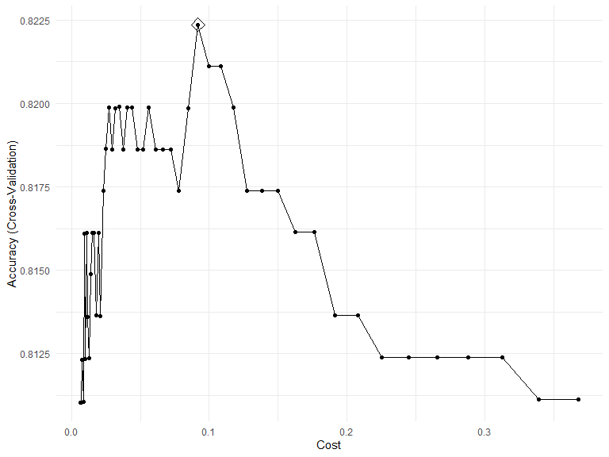
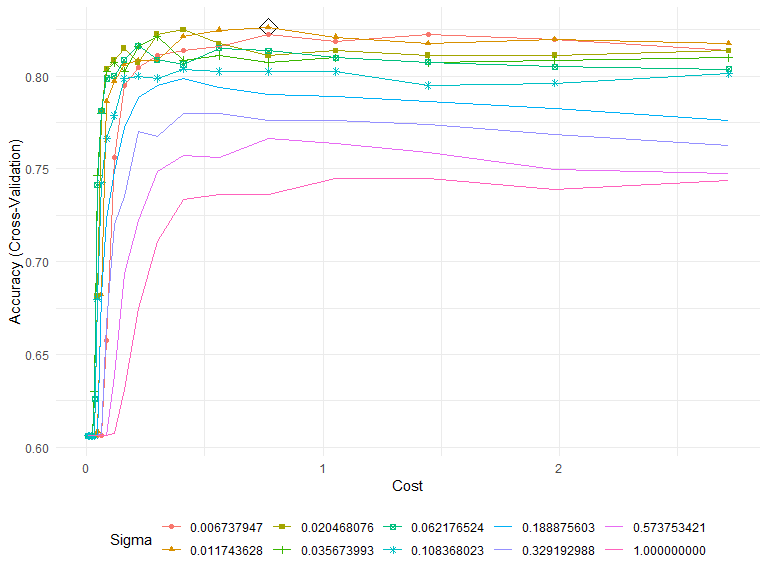
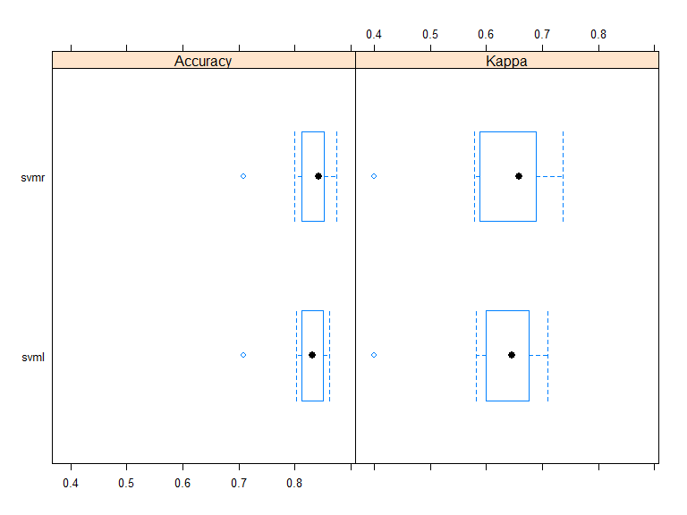

p8106\_hw5\_jsg2145
================
Jared Garfinkel
5/9/2020

``` r
data(OJ)
df = OJ %>% 
  janitor::clean_names() %>% 
  mutate(id = row_number())

set.seed(22)
train = dplyr::sample_n(df, size = 800, replace = FALSE)
test = df %>% 
  anti_join(train, by = "id")
```

``` r
ctrl1 <- trainControl(method = "cv")
set.seed(22)
df_svml <- train(purchase ~ ., data = train,
                 method = "svmLinear2",
                 preProcess = c("center", "scale"),
                 tuneGrid = data.frame(cost = exp(seq(-5, -1, len = 50))), 
                 trControl = ctrl1)

ggplot(df_svml, highlight = TRUE)
```



``` r
#output
df_svml$finalModel
```

    ## 
    ## Call:
    ## svm.default(x = as.matrix(x), y = y, kernel = "linear", cost = param$cost, 
    ##     probability = classProbs)
    ## 
    ## 
    ## Parameters:
    ##    SVM-Type:  C-classification 
    ##  SVM-Kernel:  linear 
    ##        cost:  0.09183561 
    ## 
    ## Number of Support Vectors:  364

``` r
df_svml$bestTune
```

    ##          cost
    ## 33 0.09183561

``` r
# training error rate
pred_svml_train <- predict(df_svml)
train_err = mean(pred_svml_train != train$purchase)
# test error rate
pred_svml_test <- predict(df_svml, newdata = test)
test_err = mean(pred_svml_test != test$purchase)
```

The train error rate is 0.179 and the test error rate is 0.144.

## Part 1b

``` r
svmr_grid = expand.grid(C = exp(seq(-5, 1, len = 20)),
                         sigma = exp(seq(-5, 0, len = 10)))

set.seed(22)
df_svmr <- train(purchase~., 
                 data = train,
                 method = "svmRadial",
                 preProcess = c("center", "scale"), 
                 tuneGrid = svmr_grid,
                 trControl = ctrl1)

ggplot(df_svmr, highlight = TRUE)
```



``` r
#output
df_svmr$finalModel
```

    ## Support Vector Machine object of class "ksvm" 
    ## 
    ## SV type: C-svc  (classification) 
    ##  parameter : cost C = 0.768620526593735 
    ## 
    ## Gaussian Radial Basis kernel function. 
    ##  Hyperparameter : sigma =  0.0117436284570214 
    ## 
    ## Number of Support Vectors : 430 
    ## 
    ## Objective Function Value : -289.9735 
    ## Training error : 0.165

``` r
df_svmr$bestTune
```

    ##          sigma         C
    ## 152 0.01174363 0.7686205

``` r
# train error rate
pred_svmr_train = predict(df_svmr)
train_err_svmr = mean(pred_svmr_train != train$purchase)

#test error rate
pred_svmr_test = predict(df_svmr, newdata = test, type = "raw")
test_err_svmr = mean(pred_svmr_test != test$purchase)
```

The train error rate is 0.165. The test error rate is 0.144.

## compare the models

``` r
resamp <- resamples(list(svmr = df_svmr, svml = df_svml))
bwplot(resamp)
```


